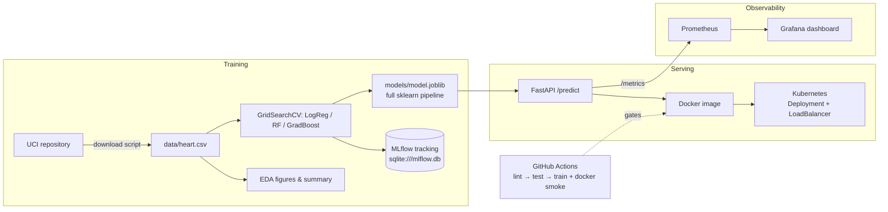

# Heart Disease Risk Prediction — End-to-End MLOps

A production-style machine learning system that predicts heart disease risk from
patient health data (UCI Heart Disease dataset, Cleveland subset), covering the
full lifecycle: EDA → training with experiment tracking → tested, containerized
FastAPI serving → CI/CD → Kubernetes deployment → Prometheus/Grafana monitoring.

**📹 Demo video:** [`docs/pipeline-demo.mp4`](docs/pipeline-demo.mp4) (6½ min, walks the
entire pipeline end to end) · **📄 Report:** [`docs/report.pdf`](docs/report.pdf)

## Where to find each assignment task

| # | Task | Evidence |
|---|------|----------|
| 1 | Data acquisition & EDA | [`scripts/download_data.py`](scripts/download_data.py), [`src/eda.py`](src/eda.py), figures in [`reports/figures/`](reports/figures/), [`reports/eda_summary.md`](reports/eda_summary.md) |
| 2 | Feature engg. & models | [`src/pipeline.py`](src/pipeline.py) (preprocessing), [`src/train.py`](src/train.py) (3 models, 5-fold GridSearchCV), results in [`reports/model_comparison.md`](reports/model_comparison.md) |
| 3 | Experiment tracking | MLflow in [`src/train.py`](src/train.py) — params, metrics, ROC/confusion artifacts per run (`make train` then `make mlflow-ui`) |
| 4 | Packaging & reproducibility | [`models/model.joblib`](models/) (full sklearn pipeline) + [`models/metadata.json`](models/metadata.json), pinned [`requirements-serve.txt`](requirements-serve.txt) |
| 5 | CI/CD & tests | [`tests/`](tests/) (pytest), [`.github/workflows/ci.yml`](.github/workflows/ci.yml) — lint → test → train → docker smoke, artifacts uploaded per run ([Actions](https://github.com/diyaRoy46/heart-disease-mlops/actions)) |
| 6 | Containerization | [`Dockerfile`](Dockerfile) — `/predict` accepts JSON, returns prediction + confidence (see [Docker](#docker)) |
| 7 | Production deployment | [`k8s/`](k8s/) — Deployment (2 replicas, probes) + LoadBalancer Service (see [Kubernetes](#kubernetes-kind-minikube-or-cloud)) |
| 8 | Monitoring & logging | [`monitoring/`](monitoring/), [`docker-compose.yml`](docker-compose.yml) — request logging, Prometheus scrape, pre-provisioned Grafana dashboard |
| 9 | Documentation & report | This README + [`docs/report.pdf`](docs/report.pdf), screenshots in [`reports/screenshots/`](reports/screenshots/) |

## Architecture



## Results

| Model (5-fold CV, ROC-AUC tuned) | Test accuracy | Precision | Recall | F1 | Test ROC-AUC |
|---|---|---|---|---|---|
| **Logistic Regression** (exported) | **0.885** | 0.839 | 0.929 | 0.881 | **0.965** |
| Random Forest | 0.852 | 0.806 | 0.893 | 0.847 | 0.951 |
| Gradient Boosting | 0.902 | 0.867 | 0.929 | 0.897 | 0.961 |

The exported model is chosen by held-out test ROC-AUC. Full comparison is
regenerated by training into `reports/model_comparison.md`; every run is logged
in MLflow with parameters, metrics, ROC curve and confusion matrix.

## Quickstart

```bash
# 1. Clean environment
python -m venv .venv && source .venv/bin/activate
pip install -r requirements-dev.txt      # or: make setup

# 2. Data + EDA
python -m scripts.download_data          # writes data/heart.csv
python -m src.eda                        # figures -> reports/figures/

# 3. Train (tracked in MLflow)
python -m src.train                      # exports models/model.joblib
mlflow ui --backend-store-uri sqlite:///mlflow.db   # browse runs on :5000

# 4. Quality gates
ruff check src tests scripts
pytest --cov=src

# 5. Serve
uvicorn src.api.main:app --port 8000     # Swagger UI at http://localhost:8000/docs
```

### Call the API

```bash
curl -X POST http://localhost:8000/predict \
  -H 'Content-Type: application/json' \
  -d '{"age":57,"sex":1,"cp":4,"trestbps":140,"chol":241,"fbs":0,"restecg":1,
       "thalach":123,"exang":1,"oldpeak":0.2,"slope":2,"ca":0,"thal":7}'
# {"prediction":1,"label":"Heart disease","probability":0.841,...}
```

`ca` and `thal` may be omitted — the pipeline's imputers fill them exactly as
during training. Invalid values (e.g. `cp: 9`) are rejected with HTTP 422.

## Docker

```bash
docker build -t heart-disease-api .
docker run -p 8000:8000 heart-disease-api
curl http://localhost:8000/health
```

The image contains only the serving code, the trained pipeline and pinned
model-critical dependencies (`requirements-serve.txt`); it runs as a non-root
user and ships a container HEALTHCHECK.

## Monitoring stack (Docker Compose)

```bash
docker compose up -d --build
```

| Service | URL | Notes |
|---|---|---|
| API | http://localhost:8000 | `/docs`, `/health`, `/metrics` |
| Prometheus | http://localhost:9090 | scrapes the API every 5s |
| Grafana | http://localhost:3000 | admin/admin, dashboard **Heart Disease API** pre-provisioned |

The dashboard shows request rate, p50/p95 latency, predictions by outcome
(`model_predictions_total`) and HTTP error rates. Every request is also logged
with method, path, status and latency.

## Kubernetes (kind, Minikube or cloud)

Used in the demo video: a [kind](https://kind.sigs.k8s.io/) cluster.

```bash
kind create cluster --name heart-disease          # once
docker build -t heart-disease-api:latest .
kind load docker-image heart-disease-api:latest --name heart-disease

kubectl apply -f k8s/
kubectl rollout status deploy/heart-disease-api

# kind has no cloud load balancer; port-forward the Service to test:
kubectl port-forward svc/heart-disease-api 8080:80 &
curl http://localhost:8080/health
```

<details>
<summary>Minikube alternative</summary>

```bash
# Minikube: build the image inside the cluster's Docker daemon
eval $(minikube docker-env)
docker build -t heart-disease-api:latest .

kubectl apply -f k8s/
minikube tunnel            # gives the LoadBalancer service an external IP
kubectl get svc heart-disease-api
curl http://<EXTERNAL-IP>/health
```
</details>

The Deployment runs 2 replicas with readiness/liveness probes on `/health`,
resource requests/limits, and Prometheus scrape annotations. For a cloud
cluster (EKS/GKE/AKS), push the image to a registry and update
`k8s/deployment.yaml`.

## CI/CD

`.github/workflows/ci.yml` runs on every push/PR:

1. **Lint** — `ruff check` (pipeline fails on violations)
2. **Unit tests** — `pytest` with coverage (pipeline fails on test failures)
3. **Train (smoke)** — reduced-grid training; model + MLflow DB uploaded as build artifacts
4. **Docker** — image build, container start, `/health` wait loop and a real `/predict` smoke test

## Repository layout

```
├── data/heart.csv              # cleaned dataset (committed; raw is re-downloadable)
├── scripts/download_data.py    # dataset acquisition
├── src/
│   ├── config.py               # paths, schema, feature groups
│   ├── data.py                 # download / load / clean
│   ├── pipeline.py             # ColumnTransformer + model pipeline builders
│   ├── eda.py                  # figures + summary -> reports/
│   ├── train.py                # GridSearchCV + MLflow logging + model export
│   └── api/                    # FastAPI app (schemas, endpoints, metrics, logging)
├── models/                     # exported pipeline + metadata (committed for serving)
├── tests/                      # pytest suite: data, pipeline, training, API
├── notebooks/                  # EDA & inference walkthrough
├── Dockerfile                  # serving image
├── docker-compose.yml          # API + Prometheus + Grafana
├── k8s/                        # Deployment + LoadBalancer Service
├── monitoring/                 # Prometheus config, Grafana provisioning + dashboard
├── .github/workflows/ci.yml    # lint / test / train / docker pipeline
├── reports/                    # EDA figures, model comparison, screenshots
└── docs/                       # report.pdf + pipeline-demo.mp4 (demo video)
```

## Reproducibility notes

- All preprocessing (median/mode imputation, scaling, one-hot encoding) lives
  **inside** the persisted sklearn `Pipeline`, so serving cannot drift from training.
- `requirements.txt` recreates the training environment;
  `requirements-serve.txt` pins the exact versions the pickled model needs.
- Fixed random seeds (`src/config.py`) and a stratified train/test split.
- `make train` retrains and re-exports the model deterministically from the
  committed dataset.

> **Note (Python 3.14):** `mlflow ui` in mlflow 3.14 fails on Python 3.14 with
> `ImportError: cannot import name 'Traversable' from 'importlib.abc'` (the
> alias was removed from the stdlib). Experiment *tracking* is unaffected.
> Workaround until mlflow ships a fix — add a `.pth` shim to your venv:
>
> ```bash
> echo "import importlib.abc, importlib.resources.abc as _ra; hasattr(importlib.abc, 'Traversable') or (setattr(importlib.abc, 'Traversable', _ra.Traversable), setattr(importlib.abc, 'TraversableResources', _ra.TraversableResources))" \
>   > .venv/lib/python3.14/site-packages/_mlflow_py314_compat.pth
> ```
